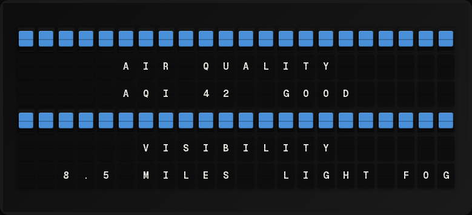

# Air Quality & Fog Plugin



Display air quality index (AQI), fog/visibility conditions, and pollen/allergen levels.

**→ [Setup Guide](./docs/SETUP.md)** - API key registration and configuration

## Overview

The Air Quality & Fog plugin combines data from PurpleAir (air quality), OpenWeatherMap (visibility), and Open-Meteo (pollen) to give you a complete picture of outdoor conditions including allergen levels.

## Features

- Real-time AQI from nearby PurpleAir sensors
- Visibility and fog detection
- Pollen/allergen levels (grass, tree, weed) via Open-Meteo (free, no API key needed)
- Color-coded status indicators
- Configurable location

## Template Variables

```
{{air_fog.aqi}}                  # Air Quality Index (0-500)
{{air_fog.air_status}}           # Status text (GOOD, MODERATE, UNHEALTHY, etc.)
{{air_fog.air_color}}            # Color tile for AQI
{{air_fog.fog_status}}           # Fog status (CLEAR, HAZE, FOG)
{{air_fog.fog_color}}            # Color tile for fog
{{air_fog.is_foggy}}             # Yes/No
{{air_fog.visibility}}           # Visibility distance (e.g., "5.2mi")
{{air_fog.grass_pollen}}         # Grass pollen (grains/m³)
{{air_fog.grass_pollen_level}}   # Grass level (LOW, MODERATE, HIGH, VERY HIGH)
{{air_fog.grass_pollen_color}}   # Color tile for grass pollen
{{air_fog.tree_pollen}}          # Tree pollen (grains/m³)
{{air_fog.tree_pollen_level}}    # Tree level (LOW, MODERATE, HIGH, VERY HIGH)
{{air_fog.tree_pollen_color}}    # Color tile for tree pollen
{{air_fog.weed_pollen}}          # Weed pollen (grains/m³)
{{air_fog.weed_pollen_level}}    # Weed level (LOW, MODERATE, HIGH, VERY HIGH)
{{air_fog.weed_pollen_color}}    # Color tile for weed pollen
{{air_fog.formatted}}            # Pre-formatted message
```

## Example Templates

### Simple Status

```
{center}AIR & FOG
AQI: {{air_fog.aqi}} {{air_fog.air_status}}
VIS: {{air_fog.visibility}}
FOG: {{air_fog.fog_status}}
```

### Allergy & Health

```
{center}ALLERGY & HEALTH
{{air_fog.grass_pollen_color}} GRASS: {{air_fog.grass_pollen}}
{{air_fog.tree_pollen_color}} TREES: {{air_fog.tree_pollen}}
{{air_fog.weed_pollen_color}} WEEDS: {{air_fog.weed_pollen}}
```

### With Colors

```
{center}CONDITIONS
{{air_fog.air_color}} AQI: {{air_fog.aqi}}
{{air_fog.fog_color}} FOG: {{air_fog.fog_status}}
{{air_fog.grass_pollen_color}} GRASS: {{air_fog.grass_pollen_level}}
```

## Quick Setup

For detailed setup instructions including API key registration, see the **[Setup Guide](./docs/SETUP.md)**.

## Configuration

| Setting | Type | Default | Description |
|---------|------|---------|-------------|
| enabled | boolean | false | Enable/disable the plugin |
| purpleair_api_key | string | - | PurpleAir API key |
| openweathermap_api_key | string | - | OpenWeatherMap API key |
| purpleair_sensor_id | string | - | Optional specific sensor ID |
| latitude | number | 40.7128 | Location latitude |
| longitude | number | -74.0060 | Location longitude |
| refresh_seconds | integer | 300 | Update interval |

## AQI Levels

| AQI | Status | Color |
|-----|--------|-------|
| 0-50 | Good | Green |
| 51-100 | Moderate | Yellow |
| 101-150 | Unhealthy (Sensitive) | Orange |
| 151-200 | Unhealthy | Red |
| 201-300 | Very Unhealthy | Purple |
| 301+ | Hazardous | Maroon |

## Pollen Levels

Pollen data is fetched from [Open-Meteo](https://open-meteo.com/) (free, no API key needed).

### Grass Pollen

| Grains/m³ | Level | Color |
|-----------|-------|-------|
| 0-20 | Low | Green |
| 21-77 | Moderate | Yellow |
| 78-266 | High | Orange |
| 267+ | Very High | Red |

### Tree Pollen (birch + alder + olive)

| Grains/m³ | Level | Color |
|-----------|-------|-------|
| 0-50 | Low | Green |
| 51-200 | Moderate | Yellow |
| 201-700 | High | Orange |
| 701+ | Very High | Red |

### Weed Pollen (ragweed + mugwort)

| Grains/m³ | Level | Color |
|-----------|-------|-------|
| 0-20 | Low | Green |
| 21-77 | Moderate | Yellow |
| 78-266 | High | Orange |
| 267+ | Very High | Red |

## Author

FiestaBoard Team

